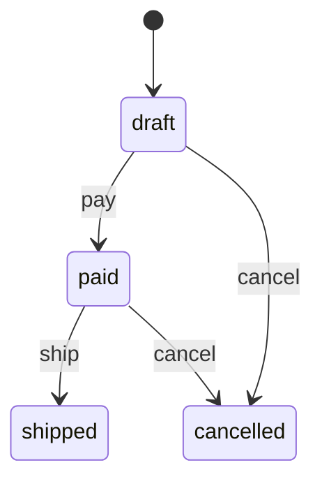

# fsmx

[](https://github.com/zkrebbekx/fsmx/actions/workflows/ci.yml)
[](https://codecov.io/gh/zkrebbekx/fsmx)
[](https://pkg.go.dev/github.com/zkrebbekx/fsmx)
[](https://goreportcard.com/report/github.com/zkrebbekx/fsmx)
[](LICENSE)

**A small, type-safe finite state machine for Go — with a Mermaid diagram for free.**

States and events are *your own* types. A typo can't compile, the transition
table is checked once at build time, your domain model is threaded through every
guard and callback, and the machine draws itself.

> **Status:** pre-1.0, actively developed. **Zero dependencies.**

## Why

Go's state-machine libraries make states and events `string` or `interface{}`, so
mistakes surface at runtime and there's no picture of the machine. fsmx is the
missing piece:

- **Type-safe.** `Machine[S, E, M]` over your own comparable state and event
  types. Wrong event? Won't compile. No magic strings.
- **Your model, threaded through.** Guards and callbacks receive the entity that
  owns the state, so business rules live where the data is.
- **Self-documenting.** `Mermaid()` renders a `stateDiagram-v2` you can drop into
  a README or an admin page — `MermaidFor(model)` even highlights where one entity
  is right now.
- **Atomic transitions.** A failing guard or callback never leaves a
  half-applied state.
- **Nothing to depend on.** The whole library is the standard library.

## Install

```bash
go get github.com/zkrebbekx/fsmx
```

## Quick start

```go
type OrderState string
const (Draft, Paid, Shipped, Cancelled OrderState = "draft", "paid", "shipped", "cancelled")

type OrderEvent string
const (Pay, Ship, Cancel OrderEvent = "pay", "ship", "cancel")

type Order struct {
	Status string // the persisted column
	Paid   bool
}

m, err := fsmx.New[OrderState, OrderEvent, *Order](Draft,
	func(o *Order) OrderState    { return OrderState(o.Status) }, // read state
	func(o *Order, s OrderState) { o.Status = string(s) },        // write state
).
	Transition(Draft, Pay, Paid).
	Transition(Paid, Ship, Shipped).
	Transition(Draft, Cancel, Cancelled).
	Transition(Paid, Cancel, Cancelled).
	Guard(Paid, Ship, func(ctx context.Context, o *Order) error {
		if !o.Paid {
			return fmt.Errorf("payment not captured")
		}
		return nil
	}).
	OnEnter(Shipped, func(ctx context.Context, o *Order) error {
		return sendShipmentEmail(o)
	}).
	Build()

// Drive it:
err = m.Fire(ctx, order, Ship) // guards → exit → advance → enter; atomic
m.Can(order, Cancel)           // structural check
m.Available(order)             // []OrderEvent valid from the current state
```

## State lives where you want

The `get`/`set` accessors decouple the machine from how state is stored — point
them at a **database column** (above), and the same machine drives
[filtrx](https://github.com/zkrebbekx/filtrx)-style reads and writes of that
column.

For ad-hoc models with no column yet, embed `Field`:

```go
type Door struct {
	fsmx.Field[DoorState]
}

m, _ := fsmx.New[DoorState, DoorEvent, *Door](Closed,
	(*Door).GetState, (*Door).SetState).
	Transition(Closed, Open, Opened).
	Build()

d := &Door{}
m.Init(d) // a fresh model starts in the initial state
```

## Transition semantics

`Fire(ctx, model, event)`:

1. Find the transition from the model's current state. None → `ErrNoTransition`.
2. Run the transition's **guards**; an error aborts (wrapped in `ErrGuard`) with
   the state **unchanged**.
3. Run **`OnExit`** of the current state (error → state unchanged).
4. Advance the state.
5. Run **`OnEnter`** of the target, then **`OnTransition`** hooks; an error here
   **rolls the state back** and returns.

So a failed `Fire` never leaves a partial transition. Errors wrap `ErrNoTransition`
and `ErrGuard` for `errors.Is`. A built machine is immutable and safe to share
across goroutines.

## The diagram

```go
fmt.Println(m.Mermaid())
```


`MermaidFor(order)` adds a highlight class to the order's current state for a live
status diagram. The output is plain Mermaid text — render it anywhere, or pass it
to [go-mermaid](https://github.com/zkrebbekx/go-mermaid) for programmatic
rendering and embedding.

## Design notes

- **One target per `(state, event)`.** Transitions are deterministic; guards
  decide *whether* a transition fires, not *which*. A duplicate is a build error.
- **Build-time validation.** `Build()` returns an error for a duplicate
  transition, a guard or hook on an undeclared transition, a nil callback, or
  missing accessors — programmer mistakes surface immediately, not at `Fire`.
- **Flat by design.** fsmx is a finite state machine. Hierarchical/parallel
  statecharts (nested states, history) are on the roadmap.

## Testing

```bash
make test   # go test -race ./...
make lint   # golangci-lint
make cover  # HTML coverage report
```

Tests are Given/When/Then [goconvey](https://github.com/smartystreets/goconvey).

## License

[MIT](LICENSE) © 2026 Zac Krebbekx
