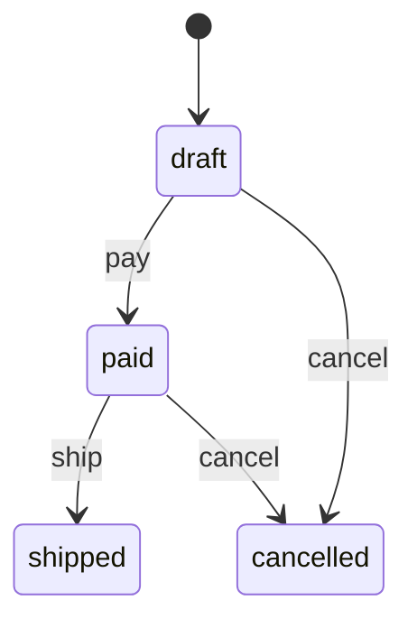

# fsmx

[](https://github.com/zkrebbekx/fsmx/actions/workflows/ci.yml)
[](https://codecov.io/gh/zkrebbekx/fsmx)
[](https://pkg.go.dev/github.com/zkrebbekx/fsmx)
[](https://goreportcard.com/report/github.com/zkrebbekx/fsmx)
[](LICENSE)

**A small, type-safe finite state machine for Go — with a Mermaid diagram for free.**

States and events are *your own* types. A typo can't compile, the transition
table is checked once at build time, your domain model is threaded through every
guard and callback, and the machine draws itself.

> **Status:** pre-1.0, actively developed. **Zero dependencies.**

## The idea in one sentence

A state machine answers: *given a **thing** in some **state**, which **event**
moves it to which next state, and is that allowed right now?* fsmx makes those
three nouns your own Go types:

| Noun | Type param | Example |
| ---- | ---------- | ------- |
| **State** — where a thing can be | `S` | `Draft`, `Paid`, `Shipped` |
| **Event** — what happens to it | `E` | `Pay`, `Ship`, `Cancel` |
| **Model** — the thing itself | `M` | `*Order` |

The machine holds the rules; your **model** holds the current state. Wrong event?
Won't compile. No magic strings.

## Install

```bash
go get github.com/zkrebbekx/fsmx
```

## Quick start

Embed `fsmx.Field` so the model carries its own state, and build with `NewFor` —
no boilerplate:

```go
type OrderState string
const (Draft, Paid, Shipped, Cancelled OrderState = "draft", "paid", "shipped", "cancelled")

type OrderEvent string
const (Pay, Ship, Cancel OrderEvent = "pay", "ship", "cancel")

type Order struct {
	fsmx.Field[OrderState] // state lives here
	PaymentCaptured bool
}

m, err := fsmx.NewFor[OrderState, OrderEvent, *Order](Draft).
	Transition(Draft, Pay, Paid).         // event Pay: Draft -> Paid
	Transition(Paid, Ship, Shipped).
	Transition(Draft, Cancel, Cancelled).
	Transition(Paid, Cancel, Cancelled).
	Guard(Paid, Ship, func(ctx context.Context, o *Order) error { // a precondition
		if !o.PaymentCaptured {
			return fmt.Errorf("payment not captured")
		}
		return nil
	}).
	OnEnter(Shipped, func(ctx context.Context, o *Order) error { // a side effect
		return sendShipmentEmail(o)
	}).
	Build()
if err != nil {
	log.Fatal(err) // a bad transition table is caught here, once
}

order := &Order{}
m.Init(order)                  // start in Draft
err = m.Fire(ctx, order, Pay)  // Draft -> Paid
m.Available(order)             // []OrderEvent you can fire now, e.g. [ship cancel]
```

## Core concepts

Each links to the full explanation in **[docs/concepts.md](docs/concepts.md)**;
every concept also has a runnable [example on pkg.go.dev](https://pkg.go.dev/github.com/zkrebbekx/fsmx#pkg-examples).

| Concept | What it is |
| ------- | ---------- |
| **State / Event / Model** | Your own types — `Machine[S, E, M]`. |
| **Transition** | `Transition(from, event, to)` — one target per `(state, event)`, deterministic. |
| **Build** | Freezes and validates the table once; programming mistakes surface here, not at `Fire`. |
| **Fire** | Applies an event: looks up the transition, runs guards, runs callbacks, advances state — atomically. |
| **Guard** | A precondition that decides *whether* a transition proceeds (not *which*). |
| **Callbacks** | `OnEnter` / `OnExit` / `OnTransition` side effects, with the model in hand. |
| **Can / Available / Init** | Ask what's possible from a state; start a fresh model. |
| **Field / Stateful** | How the model stores state (embed `Field`, or implement `GetState`/`SetState`). |
| **Mermaid** | The machine draws itself. |

Prefer to read code? [`examples/order`](examples/order) is the whole guide as a
runnable program — `go run ./examples/order`.

## Where state lives — two ways

fsmx never reflects over your model; it reads and writes state through two
functions. Supply them however suits you:

**The model owns its state** — embed `Field[S]` (gives `GetState`/`SetState`,
satisfying `Stateful[S]`) and use `NewFor`, as above. No accessor functions.

**State is an existing column or field** — use `New` with explicit get/set, no
methods added to your row type. This is the bridge to a database: point the
accessors at a `Status` column and the same machine drives
[filtrx](https://github.com/zkrebbekx/filtrx)-style reads and writes of it.

```go
type Order struct{ Status string } // a plain DB row

m, _ := fsmx.New[OrderState, OrderEvent, *Order](Draft,
	func(o *Order) OrderState    { return OrderState(o.Status) },
	func(o *Order, s OrderState) { o.Status = string(s) },
).Transition(Draft, Pay, Paid).Build()
```

## Transition semantics

`Fire(ctx, model, event)`:

1. Find the transition from the model's current state. None → `ErrNoTransition`.
2. Run the transition's **guards**; an error aborts (wrapped in `ErrGuard`) with
   the state **unchanged**.
3. Run **`OnExit`** of the current state (error → state unchanged).
4. Advance the state.
5. Run **`OnEnter`** of the target, then **`OnTransition`** hooks; an error here
   **rolls the state back** and returns.

So a failed `Fire` never leaves a partial transition. Errors wrap `ErrNoTransition`
and `ErrGuard` for `errors.Is`. A built machine is immutable and safe to share
across goroutines.

## The diagram

```go
fmt.Println(m.Mermaid())
```


`MermaidFor(order)` adds a highlight class to the order's current state for a live
status diagram. The output is plain Mermaid text — render it anywhere, or pass it
to [go-mermaid](https://github.com/zkrebbekx/go-mermaid) for programmatic
rendering and embedding.

## Design notes

- **One target per `(state, event)`.** Transitions are deterministic; guards
  decide *whether* a transition fires, not *which*. A duplicate is a build error.
- **Build-time validation.** `Build()` returns an error for a duplicate
  transition, a guard or hook on an undeclared transition, a nil callback, or
  missing accessors — programmer mistakes surface immediately, not at `Fire`.
- **Flat by design.** fsmx is a finite state machine. Hierarchical/parallel
  statecharts (nested states, history) are on the roadmap.

## Testing

```bash
make test   # go test -race ./...
make lint   # golangci-lint
make cover  # HTML coverage report
```

Tests are Given/When/Then [goconvey](https://github.com/smartystreets/goconvey).

## License

[MIT](LICENSE) © 2026 Zac Krebbekx
