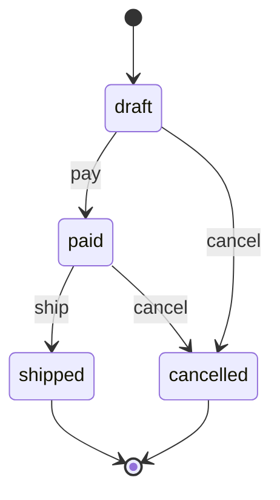

# fsmx concepts

A guide to every core concept, building one example — an **order** that moves
through a checkout — from nothing to a complete, guarded, self-documenting
machine. Each snippet is real, compiling code.

> Runnable version: [`examples/order`](../examples/order) is this whole guide as a
> tiny program. `go run ./examples/order`.

## The mental model

A state machine answers one question:

> Given a **thing** in some **state**, which **event** moves it to which next
> state — and is that allowed right now?

fsmx makes those three nouns your own Go types:

| Noun | In fsmx | Order example |
| ---- | ------- | ------------- |
| **State** (`S`) | where a thing can be | `Draft`, `Paid`, `Shipped`, `Cancelled` |
| **Event** (`E`) | what happens to it | `Pay`, `Ship`, `Cancel` |
| **Model** (`M`) | the thing itself | `*Order` |

A `Machine[S, E, M]` holds the rules. It never stores *your* data — the **model**
holds the current state; the machine just reads and writes it.

## 1. States and events are your types

Declare them as constants. Because they are real types, the compiler stops you
firing an event from the wrong set, and a typo won't slip through as a string.

```go
type OrderState string
const (
    Draft     OrderState = "draft"
    Paid      OrderState = "paid"
    Shipped   OrderState = "shipped"
    Cancelled OrderState = "cancelled"
)

type OrderEvent string
const (
    Pay    OrderEvent = "pay"
    Ship   OrderEvent = "ship"
    Cancel OrderEvent = "cancel"
)
```

String constants give the nicest diagrams (the values become the node labels).
Ints work too, but add a `String()` method if you want readable output.

## 2. The model, and where state lives

The machine needs to read and write the current state *on your model*. There are
two ways to connect them — pick by where the state already lives.

**A. The model owns its state — embed `Field` and use `NewFor`.** This is the
common case. `Field[S]` gives your model `GetState`/`SetState`, which satisfies
the `Stateful[S]` interface, so `NewFor` needs no accessor functions:

```go
type Order struct {
    fsmx.Field[OrderState] // state lives here
    PaymentCaptured bool
}

m, err := fsmx.NewFor[OrderState, OrderEvent, *Order](Draft). /* ...transitions... */ Build()
```

**B. State lives in a database column or existing field — use `New` with
accessors.** No methods added to your row type; you hand the machine two small
functions that read and write the column:

```go
type Order struct {
    Status string // the persisted column
}

m, err := fsmx.New[OrderState, OrderEvent, *Order](Draft,
    func(o *Order) OrderState    { return OrderState(o.Status) }, // read
    func(o *Order, s OrderState) { o.Status = string(s) },        // write
). /* ...transitions... */ Build()
```

Both produce the same kind of machine. The first argument, `Draft`, is the
**initial state** — the start of the diagram and what `Init` sets a fresh model
to.

## 3. Transitions

A transition is the rule "event `E` moves the model from one state to another".
Declare each one; this *is* the machine.

```go
fsmx.NewFor[OrderState, OrderEvent, *Order](Draft).
    Transition(Draft, Pay, Paid).
    Transition(Paid, Ship, Shipped).
    Transition(Draft, Cancel, Cancelled).
    Transition(Paid, Cancel, Cancelled).
    Build()
```

Rules:

- **One target per `(state, event)`.** Transitions are deterministic — from
  `Paid`, `Cancel` always goes to `Cancelled`. Declaring two targets for the same
  pair is a build error. (To choose a destination at runtime, that's a guard plus
  separate events, not two transitions on one event.)
- **Anything not declared is impossible.** Firing `Ship` on a `Draft` returns
  `ErrNoTransition`; the order does not move.

## 4. `Build` — validate once

`Build()` freezes the machine and returns an error for any *programming* mistake:
a duplicate transition, a guard or callback on a transition you never declared, a
nil callback, missing accessors. Catching these once, up front, is why `Fire`
later only ever fails for real runtime reasons.

```go
m, err := /* ...builder... */ .Build()
if err != nil {
    log.Fatal(err) // wire it up correctly before serving traffic
}
```

The built machine is immutable and safe to share across goroutines. Build it once
at startup.

## 5. `Fire` — apply an event

`Fire(ctx, model, event)` is how the model moves. It:

```go
err := m.Fire(ctx, order, Pay) // Draft -> Paid
```

1. Looks up the transition from the model's current state. None → `ErrNoTransition`.
2. Runs the transition's **guards** (next section). A rejection → `ErrGuard`,
   state unchanged.
3. Runs **`OnExit`** of the current state. An error here → state unchanged.
4. **Advances** the state.
5. Runs **`OnEnter`** of the new state, then **`OnTransition`** hooks. An error
   here → the state is **rolled back** and the error returned.

So a failed `Fire` never leaves a half-applied transition. Errors wrap
`ErrNoTransition` and `ErrGuard`, so check them with `errors.Is`.

## 6. Guards — *whether*, not *which*

A guard is a precondition on a specific transition. It returns an error to block
the move. Use it for rules the state alone can't express — "you can only ship an
order whose payment cleared":

```go
Guard(Paid, Ship, func(ctx context.Context, o *Order) error {
    if !o.PaymentCaptured {
        return errors.New("payment not captured")
    }
    return nil
})
```

```go
err := m.Fire(ctx, order, Ship)
if errors.Is(err, fsmx.ErrGuard) {
    // structurally Paid -> Shipped exists, but the rule said no; order stays Paid
}
```

Guards decide *whether* a transition fires, never *which* — the destination is
fixed by the transition.

## 7. Callbacks — side effects around a transition

Three hooks let you run effects, each receiving the model:

- **`OnExit(state, fn)`** — leaving a state, *before* it changes.
- **`OnEnter(state, fn)`** — entering a state, *after* it changes.
- **`OnTransition(from, event, fn)`** — on one specific transition, after it changes.

```go
OnEnter(Shipped, func(ctx context.Context, o *Order) error {
    return email.SendShipped(ctx, o) // an error rolls the transition back
}).
OnExit(Draft, func(ctx context.Context, o *Order) error {
    return audit.Log(ctx, "order leaving draft", o)
})
```

Order within a `Fire`: guards → `OnExit(from)` → state advances → `OnEnter(to)` →
`OnTransition`. A callback that errors aborts the whole `Fire` (rolling back the
state if it had already advanced), so effects and state stay consistent.

## 8. Asking questions: `Can`, `Available`, `Init`

```go
m.Init(order)        // set a fresh model to the initial state (Draft)
m.Can(order, Cancel) // true if a Cancel transition is defined from here (structural; ignores guards)
m.Available(order)   // []OrderEvent you could fire now, e.g. [pay cancel]
```

`Available` is handy for building UIs — show exactly the buttons that apply to the
order's current state. `Can` is structural and does **not** run guards (they need
a context and may have side effects); to know whether a guarded transition would
truly proceed, call `Fire` and inspect the error.

## 9. The diagram

The machine can draw itself as a Mermaid `stateDiagram-v2`:

```go
fmt.Println(m.Mermaid())
```



Terminal states — `shipped` and `cancelled`, which have no outgoing transition —
get an exit arrow. `m.MermaidFor(order)` adds a highlight to the order's *current*
state — drop it on an admin page to show where one entity is right now. The output
is plain Mermaid text; render it anywhere, or feed it to
[go-mermaid](https://github.com/zkrebbekx/go-mermaid).

## 10. Observers — one hook for every transition

A guard or callback is per-transition. An **observer** runs after *every*
successful transition, receiving where it came from, the event, and where it went.
It's the natural place for cross-cutting concerns — an audit trail, metrics, or
**persisting the model** after each move:

```go
Observe(func(ctx context.Context, o *Order, from OrderState, ev OrderEvent, to OrderState) error {
    return db.SaveStatus(ctx, o)  // persist on every transition; an error rolls back
})
```

Observers run last (after `OnEnter`/`OnTransition`) and, like callbacks, an error
rolls the transition back — so "the move happened" and "the move was recorded"
never disagree. This is the seam to a database: pair it with a
[filtrx](https://github.com/zkrebbekx/filtrx) `Update` of the status column.

## 11. Introspection — the machine describes itself

A built machine can answer questions about its own shape, for building UIs,
tooling, or tests:

```go
m.States()           // []OrderState{Draft, Paid, Shipped, Cancelled}
m.Events()           // []OrderEvent{Pay, Ship, Cancel}
m.IsFinal(Shipped)   // true — no outgoing transition
m.Unreachable()      // states with no path from the initial state; empty is good
```

`Unreachable()` is a one-line test that your transition table has no orphan
states — a typo'd target that nothing can ever reach shows up here.

## Putting it together

```go
m, err := fsmx.NewFor[OrderState, OrderEvent, *Order](Draft).
    Transition(Draft, Pay, Paid).
    Transition(Paid, Ship, Shipped).
    Transition(Draft, Cancel, Cancelled).
    Transition(Paid, Cancel, Cancelled).
    Guard(Paid, Ship, requirePaymentCaptured).
    OnEnter(Shipped, sendShippedEmail).
    Build()
if err != nil {
    log.Fatal(err)
}

order := &Order{}
m.Init(order)
_ = m.Fire(ctx, order, Pay)  // Draft -> Paid
_ = m.Fire(ctx, order, Ship) // Paid -> Shipped (if payment captured)
```

That's the whole library: declare typed transitions, guard them, hang effects off
them, fire events, and get a diagram for free.
